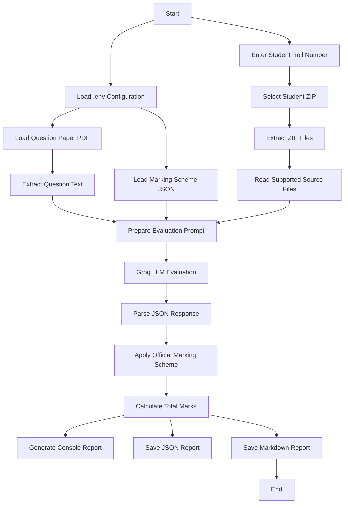

**Project Plan (5 Points)**
- Read the lab exam question paper from a PDF file.
- Extract and combine all supported source code files from the student's ZIP submission.
- Evaluate the student's implementation using the Groq LLM based on the question paper and marking scheme.
- Validate the AI-generated evaluation by applying the official marking scheme and calculating the final marks in Python.
- Generate structured evaluation reports in both JSON and Markdown formats.

**Implementation Steps (10 Points)**
- Configure the application using environment variables stored in the .env file.
- Load the official marking scheme from marking_scheme.json.
- Read and extract the question paper content using PyPDFLoader.
- Accept the student's roll number and solution ZIP file path as user input.
- Extract the ZIP archive and read all supported source files based on the configured extensions.
- Merge the extracted source code into a single input for evaluation.
- Build a structured prompt containing the question paper, marking scheme, and student's source code.
- Send the prompt to the Groq LLM using LangChain and receive the evaluation in JSON format.
- Apply the official marking scheme, validate section-wise marks, and calculate the final total marks using Python.
- Generate the evaluation report, display it on the console, and save it as both JSON and Markdown files in the reports directory.